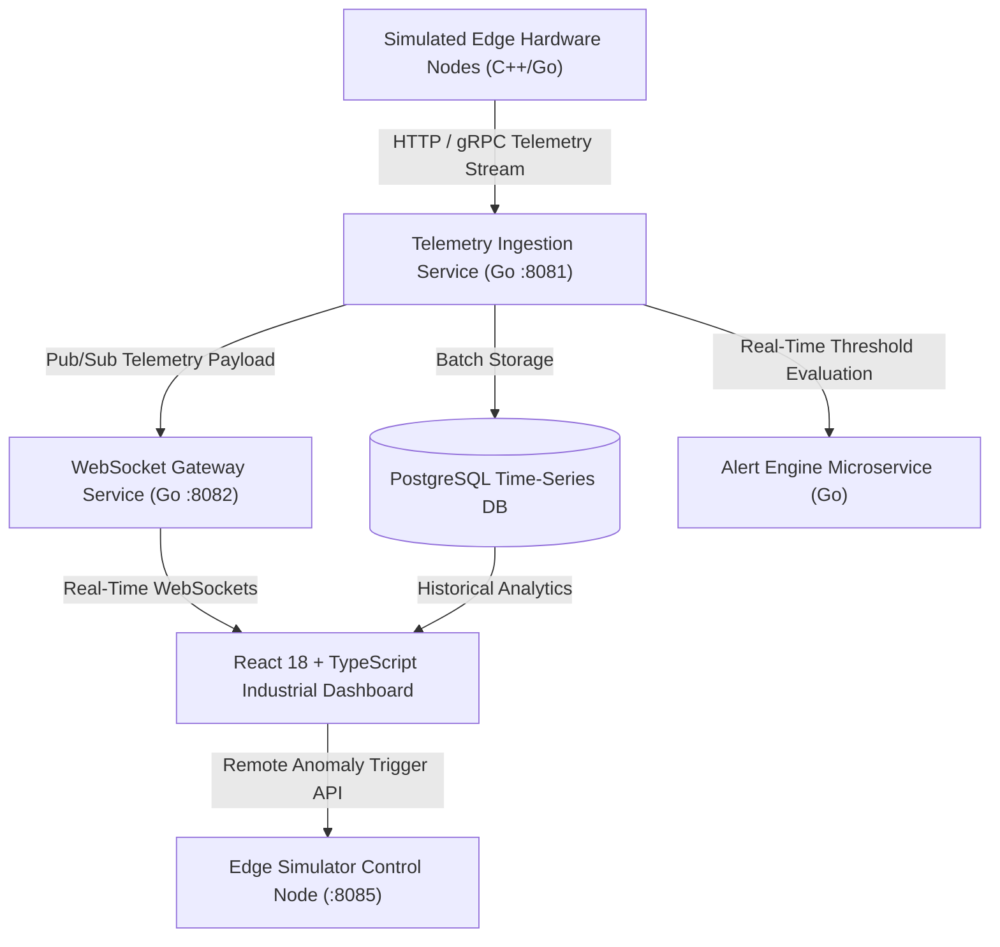

# ⚡ NexusIoT — Distributed Industrial IoT Edge & Telemetry Platform

[](https://golang.org/)
[](https://react.dev/)
[](https://www.typescriptlang.org/)
[](https://www.postgresql.org/)
[](https://redis.io/)
[](https://www.docker.com/)

An enterprise-grade, distributed Industrial IoT telemetry & edge monitoring platform (**NexusIoT**). Built for high-frequency time-series metric ingestion, real-time anomaly detection, WebSocket live streaming, and interactive 2D/3D hardware Digital Twin visualization.

---

## 🏛️ System Architecture



---

## 🌟 Key Features & Enterprise Capabilities

- ⚡ **High-Throughput Ingestion Microservice**: Built with Go 1.22 for low-latency metric ingestion and concurrent time-series data handling.
- 📡 **Real-Time WebSocket Gateway**: Pushes 1.5s metric ticks (vibration, temperature, gas PPM, pressure) directly to browser dashboards without reloading.
- 🤖 **Automated Alert & Anomaly Engine**: Evaluates safety thresholds to trigger critical alarms for thermal runaway, bearing failure, and gas leaks.
- 🔮 **Hardware Digital Twin Visualizer**: HTML5 Canvas 2D/3D rendering of turbine rotor rotation speeds, thermal gradient heat aura, and vibration harmonic ripples.
- 📊 **Oscilloscope Multi-Sensor Telemetry Chart**: Real-time canvas line oscilloscope plotting thermal, vibration, and pressure waveforms.
- 🔌 **Multi-Node Hardware Edge Simulator**: Simulated edge hardware nodes emitting physical sine wave oscillations and handling remote fault injection.
- 🐳 **Dockerized Deployment**: Fully containerized with `docker-compose.yml` for PostgreSQL, Redis, Go microservices, and React dashboard.

---

## 🗄️ Database Schema & Architecture

The database is built on **PostgreSQL 15** with time-series indexing:
- `devices`: Industrial hardware registry (ID, Name, Type, Location, IP/MAC, Health Status).
- `telemetry_data`: Time-series log table (Temperature, Vibration, Pressure, Gas PPM, Voltage, RPM, Anomaly Flag).
- `alert_events`: Log table for triggered safety alarms (Severity, Threshold, Message, Resolution Status).
- `maintenance_logs`: Technician action history and replaced hardware components.

---

## 🛠️ Microservice Endpoints

| Microservice | Port | Protocol | Purpose |
| :--- | :---: | :---: | :--- |
| **Telemetry Ingestion** | `:8081` | HTTP / REST | High-frequency metric payload ingestion (`POST /api/v1/telemetry`) |
| **WebSocket Gateway** | `:8082` | WebSockets | Real-time telemetry streaming (`ws://localhost:8082/ws`) |
| **Edge Simulator API** | `:8085` | HTTP / REST | Fault injection & simulator control (`POST /api/simulator/trigger`) |
| **React Dashboard** | `:3000` | HTTP / Web | Industrial Cyber UI dashboard |

---

## 🚀 Getting Started

### Prerequisites
- [Go 1.22+](https://golang.org/)
- [Node.js 18+](https://nodejs.org/) & `npm`
- [Docker & Docker Compose](https://www.docker.com/)

### 1. Clone & Run with Docker
```bash
git clone https://github.com/yaya2127/nexus-iot-edge-platform.git
cd nexus-iot-edge-platform
docker-compose up --build
```

### 2. Local Manual Startup

#### Run Telemetry Ingestion Microservice:
```bash
cd services/ingestion
go run main.go
```

#### Run WebSocket Gateway Service:
```bash
cd services/gateway
go run main.go
```

#### Run Edge Hardware Simulator:
```bash
cd simulator
go run edge_simulator.go
```

#### Run React Dashboard:
```bash
cd web
npm install
npm run dev
```

---

## 👨‍💻 Author

**Yared Kinetibeb Tesfaye**
* 🎓 5th-Year Computer Engineering Senior @ Addis Ababa Science and Technology University (AASTU)
* 🌐 Live Portfolio: [yaya2127.github.io/Personal-Portfolio](https://yaya2127.github.io/Personal-Portfolio/)
* 💼 LinkedIn: [linkedin.com/in/yared-kinetibeb-3b788b350](https://www.linkedin.com/in/yared-kinetibeb-3b788b350/)
* 📧 Email: [kinetibebyared@gmail.com](mailto:kinetibebyared@gmail.com)
