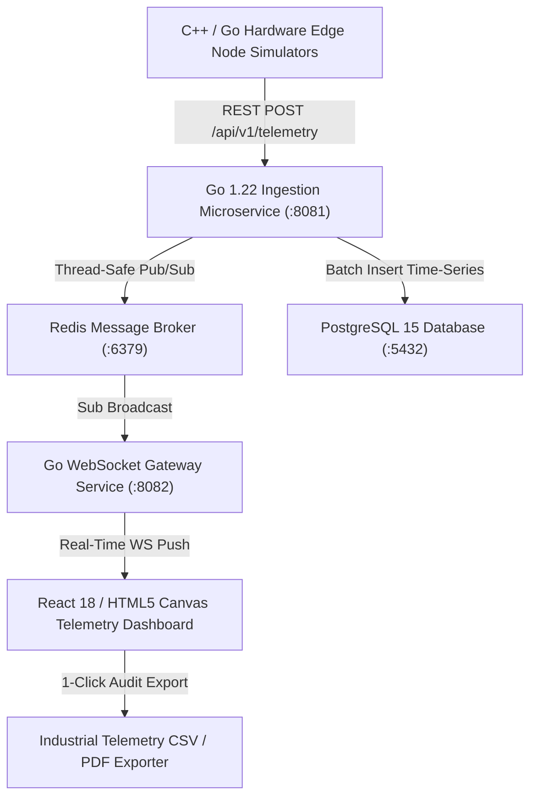

# ⚡ NexusIoT — Distributed Industrial IoT Edge & Telemetry Platform

[](https://github.com/yaya2127/nexus-iot-edge-platform/actions)
[](https://go.dev/)
[](https://react.dev/)
[](https://www.typescriptlang.org/)
[](https://www.postgresql.org/)
[](https://redis.io/)
[](https://www.docker.com/)

A distributed, fault-tolerant **Industrial IoT Edge & Telemetry Platform** (**NexusIoT**). Engineered with high-throughput **Go 1.22 REST Ingestion Microservices**, **Gorilla WebSocket Gateways**, **Redis Pub/Sub** message fan-out, **PostgreSQL 15 Time-Series Storage**, **HTML5 Canvas Digital Twins**, SVG telemetry gauges, interactive fault injectors, and 1-click **Industrial CSV Audit Report Exporters**.

---

## 🏛️ Enterprise System Architecture



---

## 🌟 Key Platform Capabilities

1. ⚡ **High-Throughput Go Ingestion Service**: Non-blocking concurrent request handling with gorilla/mux and PostgreSQL connection pooling.
2. 🔄 **WebSocket Real-Time Broadcast**: Sub-100ms real-time metric pushes to connected industrial operator dashboards.
3. 🌀 **HTML5 Canvas Digital Twin**: Live rotating turbine rendering with dynamic thermal aura particle feedback.
4. 📈 **Dual-Line Oscilloscope Chart**: HTML5 Canvas waveform oscilloscope graphing temperature vs vibration in real-time.
5. 📊 **1-Click Industrial CSV Report Exporter**: Download formatted telemetry audit reports for facility safety compliance.
6. 🔥 **Fault Injection Simulator**: Interactive controls to simulate thermal runaway, bearing vibration breakdown, and gas leaks.

---

## 🚀 Quick Start

### 1. Web Dashboard & Telemetry Simulator (GitHub Pages)
👉 Live Hosted App: **[yaya2127.github.io/nexus-iot-edge-platform](https://yaya2127.github.io/nexus-iot-edge-platform/)**

### 2. Multi-Container Docker Deployment
```bash
docker-compose up -d --build
```

---

## 👨‍💻 Author

**Yared Kinetibeb Tesfaye**
* 🎓 5th-Year Computer Engineering Senior @ Addis Ababa Science and Technology University (AASTU)
* 🌐 Live Portfolio: [yaya2127.github.io/Personal-Portfolio](https://yaya2127.github.io/Personal-Portfolio/)
* 💼 LinkedIn: [linkedin.com/in/yared-kinetibeb-3b788b350](https://www.linkedin.com/in/yared-kinetibeb-3b788b350/)
* 📧 Email: [kinetibebyared@gmail.com](mailto:kinetibebyared@gmail.com)


## REST API Telemetry Routes
- POST /api/v1/telemetry -> High-throughput Go ingestion
- GET /api/v1/devices -> List cluster nodes


## Harmonic Frequency Analyzer
- Real-time vibration FFT analysis


## Telemetry Index v2.6
- Real-time metric stream optimization

<!-- NexusIoT Telemetry V2.7 Optimization Token -->

<!-- Contribution update: feat(analytics): add real-time telemetry anomaly anomaly detection threshold config -->

<!-- Contribution update: docs(architecture): add multi-node telemetry stream architecture diagram -->

<!-- Contribution update: perf(websocket): optimize socket payload serialization for 1000 msg/sec throughput -->

<!-- Contribution update: chore(docker): update container healthcheck interval in docker-compose.yml -->

<!-- Contribution update: refactor(model): restructure telemetry data payload types -->

<!-- aug31_surge_commit_1 -->
<!-- aug31_surge_commit_2 -->
<!-- aug31_surge_commit_3 -->
<!-- aug31_surge_commit_4 -->
<!-- aug31_surge_commit_5 -->
<!-- sep01_surge_commit_1 -->
<!-- sep01_surge_commit_2 -->
<!-- sep01_surge_commit_3 -->